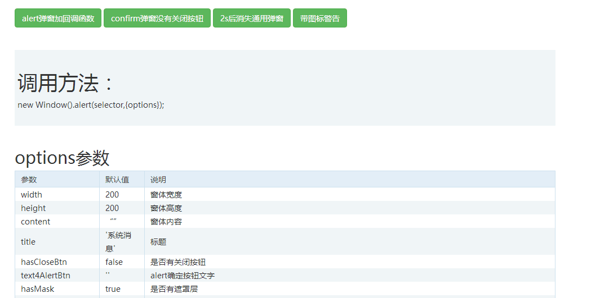
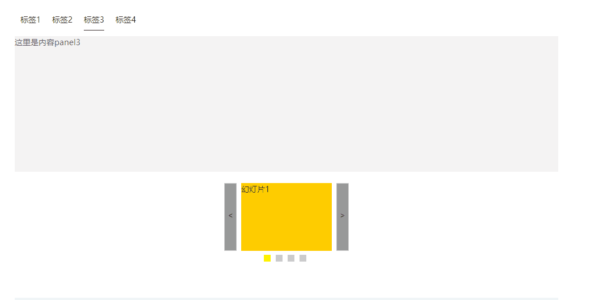
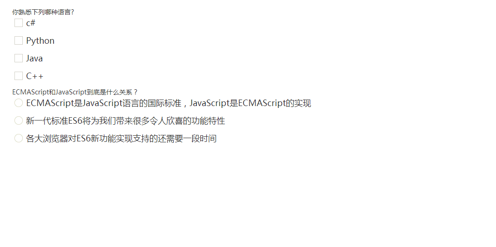
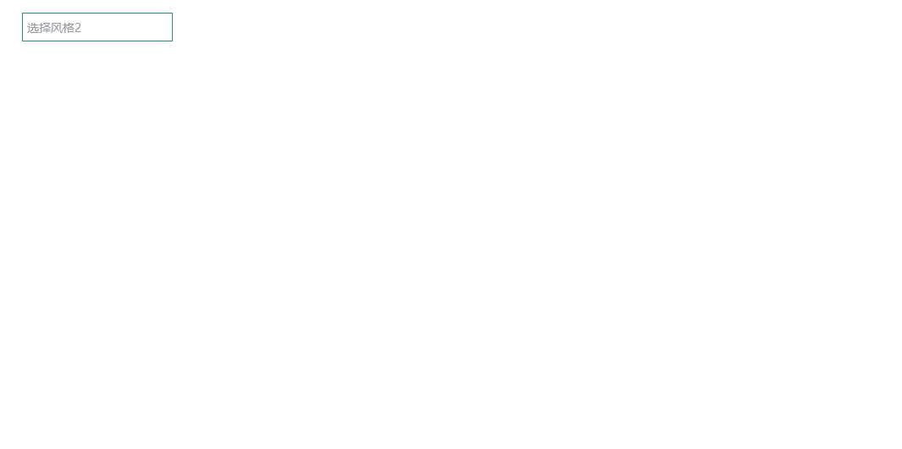
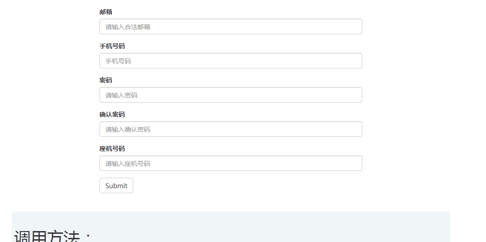

# web组件

### 这些主要是我在工作对一些常用的ui，自己编写的组件。用jQuery开发，require.js进行模块加载。并将组件抽象出widget类，使得后续的组件都有一个统一的格式和风格。
---

* ### 弹窗组件
简介：支持皮肤，自定义事件，各种属性

```javascript
new window().alert(options);
new window().confirm(options);
new window().common(options);
```

* ### Tab标签
简介：支持

```javascript
new tab("selector",options,callback(api));
```

* ### mcheck-radio、checkbox 美化
简介：简单易用的原生单选复选框美化

```javascript
new mcheck("selector",options);
```

* ### slect-下拉框美化
简介：简单易用的下拉框美化

```javascript
new select("selector",options);
```
* ### dataCheck-表单验证
简介：自定义触发事件,自定义错误信息提示

```javascript
new dataCheck("selector",options);
```
* ### 音乐播放器

简介：自定义控制条，拖拽播放
```javascript

```


